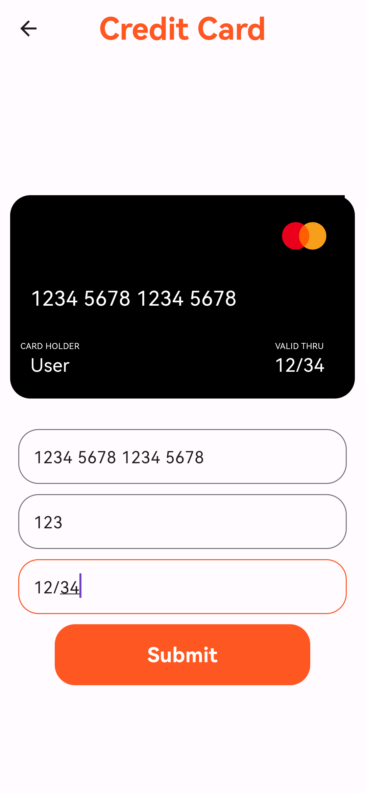

# Ecommerce Sneaker App (SneakerCentre)

## Main Page

## Cart

## Credit Card Payment

## Address Page

Sneaker centre is an ecommerce app that is created using Flutter + Firebase.
This application mainly focuses on sneaker shopping with a wide range of essential features such as cart, payment methods, promo codes etc.
(Created as a summer project to know more about Flutter and dart programming)